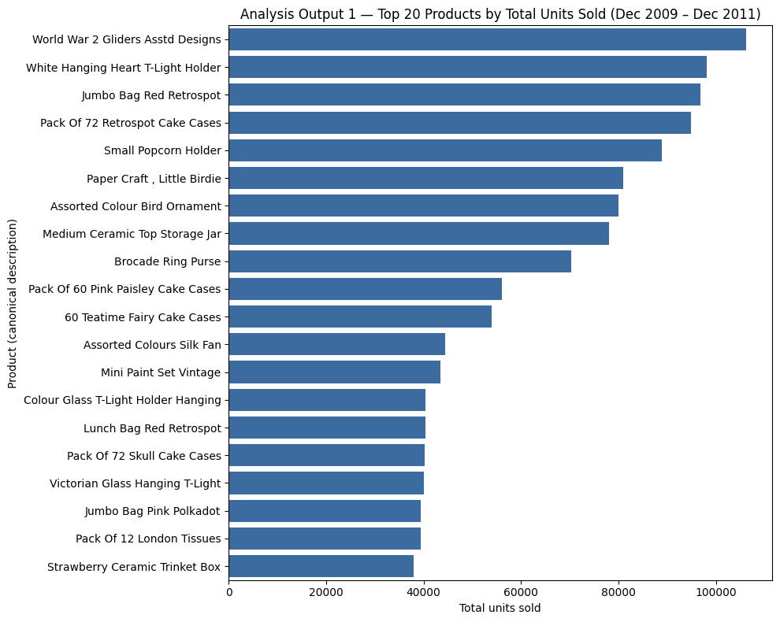
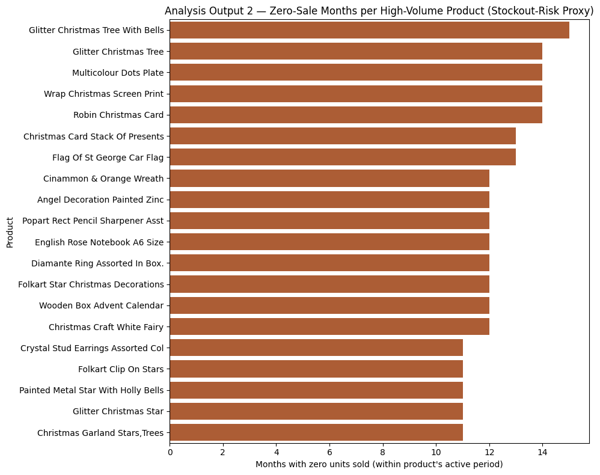
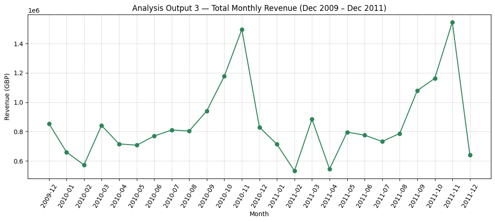
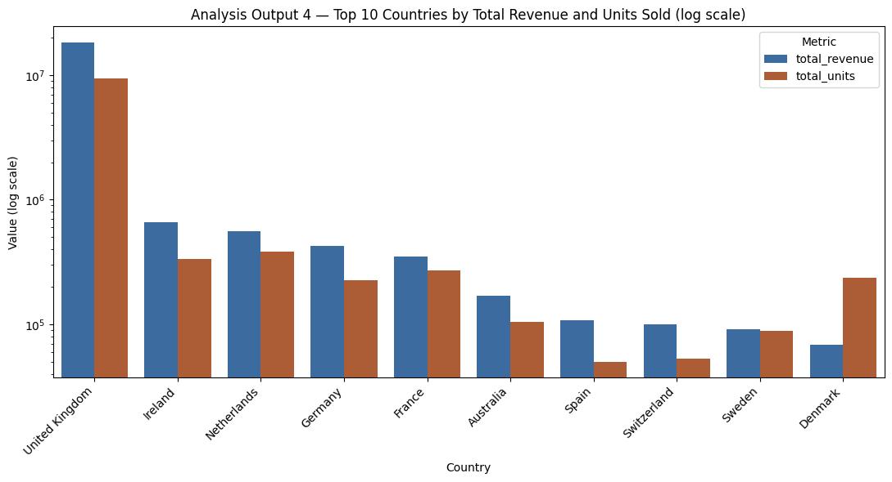

# retail-data-cleaning-pipeline

A cleaning pipeline for the UCI Online Retail II dataset, built as my Apex Project for the BS in
Data Science & AI at BITS Pilani (Trimester 3, problem P4: Retail and E-Commerce).

The raw data is 1,067,371 transactions from a UK online gift retailer, December 2009 to December
2011, and it is messy in the ways real sales data usually is: returns mixed in with sales as
negative quantities, missing customer IDs on roughly a quarter of the rows, the same product
spelled several ways, prices of zero, and duplicate invoice lines. An inventory assistant is only
as good as the data behind it, so the pipeline turns this into two clean tables and measures what
every step changed.

Scope: this prepares and analyses the data. No machine learning model is trained here.

## Before and after

| Metric | Before | After |
|---|---|---|
| Rows | 1,067,371 | 1,010,534 |
| Duplicate rows | 34,335 | 0 |
| Negative quantity rows (returns) | 22,950 | 0 |
| Zero or negative prices | 6,207 | 0 |
| Missing descriptions | 4,382 | 0 |
| Distinct StockCodes | 5,305 | 4,984 |
| Missing CustomerID | 243,007 | 231,043 |

The 56,837-row drop is fully explained by the 22,950 returns moved into their own table (kept,
not deleted) and the 33,887 duplicate rows removed from sales. The 231,043 rows still missing a
CustomerID are there on purpose: they are flagged as guests rather than dropped, so product-level
demand keeps those sales. The full table is in `quality_report.csv`.

## The pipeline

| Step | What it does |
|---|---|
| 1 | Load both Excel sheets (2009–2010, 2010–2011) and merge them, keeping the source year |
| 2 | Inspect: types, nulls, duplicates, value counts, recorded as the BEFORE snapshot |
| 3 | Separate the 22,950 returns (negative quantity) from sales; returns are stored, sales go forward |
| 4 | Remove exact duplicate rows |
| 5 | Flag rows with no CustomerID as `is_guest` instead of dropping them |
| 6 | Set zero or negative prices to missing and fill each with the median price for that StockCode, falling back to the overall median where a StockCode has no valid price |
| 7 | Standardise InvoiceDate and derive date, month and year |
| 8 | Standardise StockCode and Description: one canonical description per StockCode, using the most frequent one |
| 9 | Standardise country labels, e.g. `EIRE` to `Ireland`, `RSA` to `South Africa` |
| 10 | Encode categorical columns |
| 11 | Aggregate to one row per product per month: units sold, revenue, number of invoices |
| 12 | Scale units and revenue with MinMaxScaler, keeping the originals alongside |
| 13 | Build the before/after quality report |
| 14 | Export `clean_transactions.csv` and `clean_retail.csv` |

## What the clean data shows

Four charts from the cleaned product-month table.

### 1. The top sellers are cheap, everyday items, not one big hit

World War 2 Gliders Asstd Designs leads with just over 106,000 units, ahead of White Hanging Heart
T-Light Holder (about 98,000) and Jumbo Bag Red Retrospot (about 96,000). Almost the whole top 20
is cheap items people buy in bulk: cake cases, tealight holders, gift bags, storage jars. None of
them are big-ticket products, they just sell month after month.

### 2. The stockout-risk proxy is mostly picking up seasonal products

Glitter Christmas Tree With Bells went 15 months with zero units sold, and most of the list is
Christmas decorations, wreaths and advent calendars. A Christmas ornament with 15 zero-sale months
isn't a stockout, it's a seasonal product doing what seasonal products do. With no stock-level
data in this dataset, this chart works as a seasonality flag rather than a restocking alarm.

### 3. Revenue peaks every November and dips every February

Revenue climbs from about £0.94M in September 2010 to roughly £1.5M in November 2010, and the
November 2011 peak is a little higher, just over £1.55M. February is the low point in both years,
around £0.53–0.57M. The drop in December 2011 isn't real: the dataset only covers the first 9 days
of that month.

### 4. The UK dominates, and Denmark buys differently

The UK brings in about £17M against Ireland's roughly £0.65M in second place, over 25 times more,
which is why the chart needs a log scale. Denmark's revenue is lower than most of the top 10 but
its unit count is much higher, so Danish orders lean towards cheaper items bought in bulk.

## Limitations

- The data ends in December 2011, so these demand patterns may not match how people shop today.
- The zero-sale-month proxy can't tell a real stockout from seasonal dormancy or a discontinued
  product, because the dataset has no stock levels. Chart 2 shows that limitation in practice.
- Filling bad prices with each product's median assumes its price stayed roughly stable, which
  understates the effect of any promotions or discounts.
- Keeping guest rows was right for product-level analysis, but customer-level work would still
  need to deal with the 22.9% of sales that have no customer attached.

## Outputs

- `clean_transactions.csv`: the cleaned transaction table, 1,010,534 rows
- `clean_retail.csv`: one row per product per month, 67,390 rows
- `quality_report.csv`: the before/after comparison above

The two clean CSVs are not committed because of their size (the transaction table is about
130 MB). Running the notebook regenerates them.

## Run it

1. Download Online Retail II from the UCI Machine Learning Repository:
   https://archive.ics.uci.edu/dataset/502/online+retail+ii
2. Put `online_retail_II.xlsx` next to the notebook.
3. Open `retail_data_cleaning_pipeline.ipynb` in Jupyter or Google Colab and run all cells.

Python 3.10+, pandas, NumPy, scikit-learn, Matplotlib, Seaborn, openpyxl.
